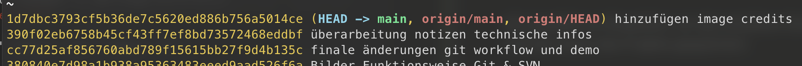

# Wie wir mit git Arbeiten:

Jeder commit erhält einen einzigartigen commit-hash. Jeder Commit kennt den (und nur den) vorherigen Commit.

Git unterscheidet zwischen 3 Dateizuständen:
  - **Modified** (geändert aber noch nicht in lokaler Datenbank)
  - **Staged** (bedeutet, dass eine geänderte Datei in ihrem gegenwärtigen Zustand für den nächsten
Commit vorgemerkt ist)
  - **Committed** (bedeutet, dass die Daten sicher in der lokalen Datenbank gespeichert sind)

Wichtig für Kommandozeile: Nur Dateien in der Staging-Area ("index") werden für commit berücksichtigt

## commit & push:
Wir werden zunächst den Workflow, den wir aus SVN kennen, beibehalten.

Das heißt, wir arbeiten alle zusammen auf dem **"main"**-Branch:

* Jeder holt sich den neusten Stand und checkt den **"main"**-Branch lokal bei sich aus.
* Die Entwicklung findet lokal auf dem **"main"**-Branch (ursprünglich: trunk) statt.
* Änderungen einchecken mit **"commit" & "push"**:
    - Lokale Änderungen werden durch einen **commit** einer Referenz versehen und in lokale Datenbank verschoben.
    - Durch einen **push** wird die entstandene Sammlung an **commits** veröffentlicht.
    
    **--> Es wird empfohlen, während der Bearbeitung von Tickets, so häufig wie möglich Zwischenstände zu committen. So entsteht eine feingranulare History aus kleinen Arbeitsschritten, die die Lesbarkeit und die Nachvollziehbarkeit der gemachten Änderungen verbessert.**

Außerdem können dadurch einzelnen Zwischenstände leichter wiederhergestellt werden.

## fetch & pull:
Das Holen des neusten Stands wird ebenfalls unterteilt in 2 Schritten:
* **"fetch"**: Hole alle Änderungen vom remote und lege sie erstmal in der lokalen Datenbank ab.
* **"pull"**: Spiele die Änderungen die durch **fetch** gekommen sind ein und gliedere alle Änderungen in mein bestehendes System ein.

**--> Erlaubt es eingehende Änderungen zu begutachten, bevor der Code in meinen lokalen Stand eingespielt wird.**
    
## Merge vs Rebase
### Dazu gleich mehr. Spoiler: Wir werden _Rebase_ benutzen! 

# DEMO:
[akdb-git-workshop](https://github.com/drzzlx/akdb-workshop-git)

# Git Workflow & mögliche Zukunftsaussichten:
Es werden zu beginn drei Arten von **Branches** definiert:

* ### **"main"**: 
    Ist immer in einem releasebaren Stand. Nur vollendete und fertig getestete Features sind im **main** enthalten.

* ### **"develop"**: 
    Ist ein direktes Abbild vom **main** in den alle Änderungen aus der Entwicklung integriert werden. Mit dem **develop** werden fertig entwickelte Features, im Kontext des gesamten Programms getestet. 

    ==> Aus diesem Branch kann beispielsweise ein Nightly Build erzeugt werden, auf dem uneingeschränkt getestet werden kann.

* ### **"feature"**: 
    Für jedes Feature / Ticket wird ein eigener **feature**-Branch erstellt. Innerhalb eines **feature**-Branches werden alle Anforderungen eines Tickets umgesetzt. 
    
    Idealerweise wird eine Jenkins Pipeline für jeden einzelnen **feature**-Branch erstellt und bei jedem Commit auf etwaige Fehler überprüft. 

    ==> Nightly Build Stand wird durch Jenkins Fehler nicht mehr blockiert.. 

Features können innerhalb eines feature Branches initial getestet werden und sobald sie die nötigen Anforderungen erfüllen, werden sie in den develop Branch übernommen. Wenn die Integration der neuen Features problemlos funktioniert, wird der develop in den main Branch übernommen, der letztendlich eine releasefähige Version des Programms darstellt.
