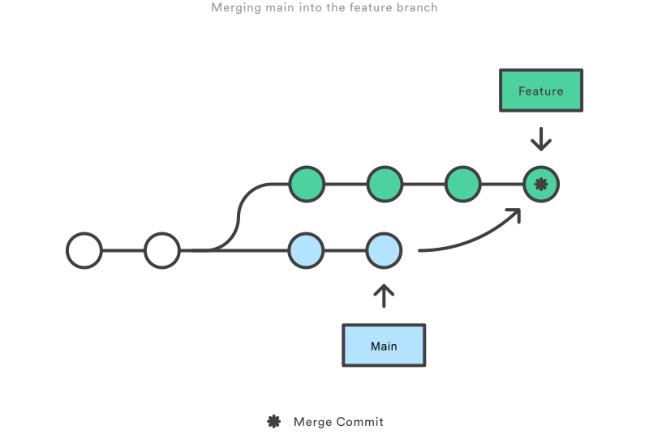
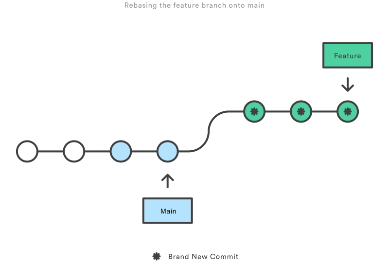

# Git Demo

```bash
# Repository muss geklont werden.
git clone <ssh-Url-hier-angeben>
```


## Erstellen und pushen eines Commits:

  ```bash
  # Stellen wir sicher dass wir unseren main Branch ausgecheckt haben.
  git checkout main
  # Erstellen eines Files
  echo 'Willkommen zur Git Schulung' > first_file.txt
  # Hinzufügen des Files in die Staging-Area
  git add first_file.txt
  # Commiten des Files (-m erlaubt inline-commit in Konsole)
  git commit -m "Mein erster Commit"
  # Hinzufügen aller Commits zum Remote-Repository 
  git push
  # schauen wir uns nun die Commit-Historie an
  git --no-pager log --pretty=oneline --graph
  ```


## Branching
Eines der Kernkonzepte ist das Branching
```bash
# Erstellen wir nun einen neuen Branch (-b) (dieser Schritt wird in der Regel über Gitlab/etc. gelöst);
git checkout -b 'feature/1-main-erstes-feature'
# Bearbeiten unsere Datei;
echo 'Zweite Zeile' >> first_file.txt
# Hinzufügen des Files in die Staging-Area
git add first_file.txt
# Committen sie;
git commit -m "added feature #1 Zweite Zeile"
# Hinzufügen aller Commits zu unserem neu erstellten Branch
git push --set-upstream origin 'feature/1-main-erstes-feature'
git --no-pager log --pretty=oneline --graph --all 
```
Mithilfe verschiedener Branches kann man an mehreren Zwischenständen gleichzeitig arbeiten

**_Wichtig: Man muss alle Änderungen, die man in einem Branch behalten will committen, bevor man einen Branch wechselt. Sonst werden diese Änderungen mit in den anderen Branch genommen._** 

Nach der Implementierung des Features wird der Inhalt in den Dev/Main branch gemerged
```bash
git checkout main 
git merge "feature/1-main-erstes-feature"
git push
```


## Zurücksetzen auf einen bestimmten Commit
```bash
#Commit-Id herausfinden
first_commit=$(git log --reverse | head -n 1 | cut -d " " -f 2)
echo "First Commit-Sha is: $first_commit"
#reset local branch to commit
git reset --hard $first_commit
git --no-pager log --pretty=oneline --graph
```
Die Commit History des lokalen und des Remote-Branches unterscheiden sich jetzt
ein Push-Versuch mit veränderter Historie schlägt fehl:
```bash
# Erstellen eines Files
echo 'Das ist das zweite File' > second_file.txt
# Hinzufügen des Files in die Staging-Area
git add second_file.txt
# Commit und Push
git commit -m 'Mein zweiter Commit'
git push
git --no-pager log --pretty=oneline --graph --all 
```


## Force-Push (GEFÄHRLICH, daher bei uns deaktiviert)
Sich unterscheidende Commit-Historien lassen sich mit einen force push auflösen:
Dabei wird dem Remote-Server die lokale Historie aufgezwungen
```bash
# Force-Push mittels -f oder --force
git push -f
```


## Den letzten commit überschreiben
Überschreibe den letzten Commit und erstelle einen neuen Commit-Hash
Wenn der Commit bereits in einem Remote-Repo liegt, kommt es zum Konflict beim Push
Also ausschließlich bei lokalen nicht veröffentlichten Änderungen / oder eigenen Feature-Branches
 ```bash   
  # Erstellen wir ein File
touch "ich_committe_zu_schnell.txt"
git add ich_committe_zu_schnell.txt
git commit -m "Der kommit war etwas voreilig"
git --no-pager log --pretty=oneline --graph --all
echo "die Änderung soll noch mit in den Commit" > ich_committe_zu_schnell.txt             
git add ich_committe_zu_schnell.txt
git commit --amend -m "Schnell noch den letzten Commit überschrieben"
git push
git --no-pager log --pretty=oneline --graph --all
  ```


## Merge
Zusammenführen mehrerer Commits;



Sehr häufiges Szenario: Merge-Konflikt durch überschneidende Dateiinhalte oder unterschiedliche Commit-Historien
Lösung 1 auflösen der Merge-Konflikte (etwa in GitHub) im Ziel Branch
  - Gefährlich, was ist bei Fehlern?
  - Überlass ich das einen Code-Reviewer? (Nein!)
  - Es kann aber sein dass der Commit (etwa ein Hotfix im main) auch für weitere Branches wichtig ist
Lösung 2: ein back-merge
  - Statt mit dem eigentlichen Git-Flow zu mergen, machen wir das genau andersherum

generieren wir zunächst das Problem-Szenario
```bash
git checkout -b "feature/3-verwaister-branch"
echo "verwaistes feature von vor 3 Monaten" > file_1.txt
echo "verwaistes feature von vor 3 Monaten" > file_2.txt
git add file_1.txt file_2.txt
git commit -m "verwaistes feature von vor 3 Monaten"
git push --set-upstream origin "feature/3-verwaister-branch"
git checkout main
i=1
while [ $i -lt 10 ]; do echo "$i" > "file_$i.txt" && i=$[$i+1];  done 
git add *
git commit -m "in der zwischenzeit sind andere features eingeflossen"
git push
```
ein Mergeversuch würde in Mergekonflikten enden (und hätte einen non-linearen Baum zur Folge)
wir können uns entscheiden, was wir aus der Historie machen wollen.

Der Standardweg (back-merge):
```bash
  git checkout "feature/3-verwaister-branch"
  git merge main -m "Merged verwaister Branch" "feature/3-verwaister-branch"
```
jetzt müssen wir den merge Konflikt lösen, indem wir ```file_1.txt``` und ```file_2.txt``` händisch bearbeiten
anschließend:
```bash
  git add *
  git commit -m "Back-Merged main into feature/3-verwaister-branch"
  git push 
  # Danach mergen wir zurück in den eigentlich branch in den wir mergen wollen
  git checkout main

  git merge --no-ff 
```
Konsequenz: linearer Commit-Tree
andere Möglichkeit eines linearen Baum zu erzeugen
```bash
  git --no-pager log --pretty=oneline --graph 
```


## _Rebase (GEFÄHRLICH!)_

```git rebase``` und ```git merge``` lösen das selbe Problem, ABER...



Man kann lineare Bäume erzwingen.
Dafür muss man statt eines merges ein sogenannten _rebase_ durchführen.

Ein rebase nimmt eine Reihe commits und setzt sie auf einen anderen Commit/Branch-head.

Dabei ändern sich jedoch der Commit hash und es wird zwangsweise ein neuer Commit erstellt. 
**_Das ist gefährlich!_**
```bash
 LAST_COMMIT=$(git log | head -n 2 | tail -n 1 | cut -f 2 -d " ")
 git reset --hard $LAST_COMMIT
```
```bash
  git rebase "feature/3-verwaister-branch"
```

Man kann mit rebase defacto jeden Commit-Tree zurechtbiegen, indem man eine Reihe von Commits auf einen älteren setzt.
```bash
  git rebase -i HEAD~3
```
Niemals Rebases durchführen mit Commits, die schon gepushed sind!
Der merge bleibt sicherer, einfacher und nachvollziehbarer!


## _"Entfernen sensitiver oder großer Daten (GEFÄHRLICH!)"_
Sehr gefährlicher Eingriff!

Wir schreiben dabei die komplette Git-History ab dem Commit um. Jeder offene Branch wird bei einem Merge-Versuch Konflikte erzeugen

Erzeugen wir zunächst das Szenario:
```bash
tar cfvz mein_tar_archiv.tar.gz images/img.png
git add mein_tar_archiv.tar.gz
git commit -m "Der Übeltäter wird dem Repo hinzugefügt"
git push
# Wir stellen fest, dass wir ein Binary gepushed haben und "löschen" dieses (scheinbar).
git rm mein_tar_archiv.tar.gz
git commit -m "pseudo-removed mein_tar_archiv.tar.gz"
git push 
# schauen wir nun die größe des Branches an
git gc
git count-objects -v
# und geben uns die größten Dateien aus
git verify-pack -v .git/objects/pack/pack-*.idx \
| sort -k 3 -n \
| tail -3
# die untereste Datei ist unsere größte, aber welche Datei ist das?
export large_file=$(git verify-pack -v .git/objects/pack/pack-*.idx | sort -k 3 -n | tail -1 | cut -d " " -f 1)
git rev-list --objects --all | grep $large_file
# Tatsächlich ist unsere Datei also noch da
# Wir müssen also alle Commits hinter dem Commit dieses Files neuschreiben um jeden Snapshot zu entfernen
git --no-pager log --oneline --branches -- mein_tar_archiv.tar.gz

# los geht's
export commit_of_first_commit_with_file=$(git log --oneline --branches -- mein_tar_archiv.tar.gz | tail -n 1 | cut -d " " -f 1)
git filter-branch --index-filter "git rm --ignore-unmatch --cached mein_tar_archiv.tar.gz" -- "$commit_of_first_commit_with_file^.."
# und den reflog und verwaiste objekte löschen
git reflog expire --expire=now --all && git gc --prune=now --aggressive
# jetzt müsste die Anderung noch gepushed werden
# lieber nicht tun
```
Ganz ehrlich, das ist zu kompliziert...

Da gibt es andere tools für: 

https://docs.github.com/de/authentication/keeping-your-account-and-data-secure/removing-sensitive-data-from-a-repository

Sorgt besser dafür, dass sowas nie im Remote-Branch landet!
Ansonsten nutzt bsplw. bfg 

```bash
bfg --strip-blobs-with-ids blobs.txt your-repo.git
```
Jetzt ist zwar die Commit-History neu beschrieben, lokal existiert jedoch noch der reflog und verwaiste blob-Objekte.
```bash 
git reflog expire --expire=now --all && git gc --prune=now --aggressive
```